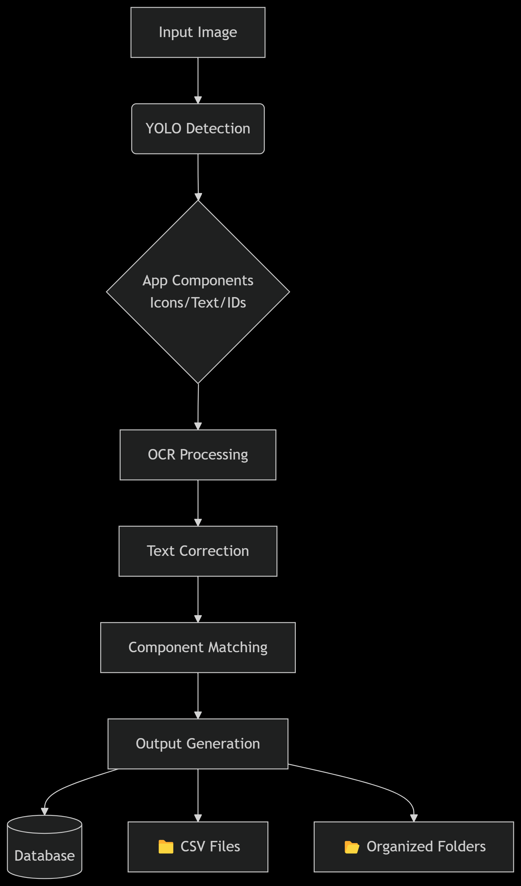
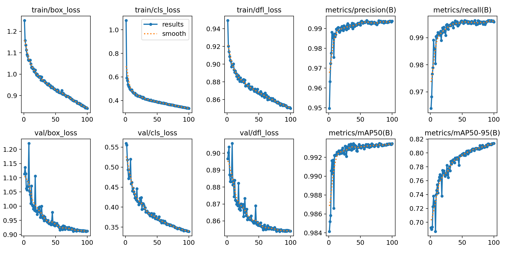

# AppUsageExtractor

[](https://www.python.org/downloads/)


> [!NOTE]
> This project is currently under active development. Core functionality is implemented with ongoing improvements.

An end-to-end computer vision pipeline that detects smartphone app interfaces using YOLO object detection and extracts usage statistics through OCR text recognition.



## Table of Contents
- [Overview](#%EF%B8%8F-pipeline-overview)
- [Key Features](#-key-features)
- [Project Structure](#-project-structure)
- [Output Details](#-output-structure)
- [Model Information](#-model-information)
- [Performance Benchmarks](#-performance-benchmarks)
- [Limitations & Future Work](#%EF%B8%8F-limitations--future-work)
- [Installation](#-installation)
- [Usage](#-usage)


## ⚙️ Pipeline Overview

This project implements a multi-stage pipeline to accurately extract application usage statistics from images of smartphone screens on analyzing their app usage data. Here's a breakdown of the process:

1.  **Input:** The pipeline begins with a smartphone screenshot/image (e.g., from Android's Digital Wellbeing or iOS Screen Time).

2.  **Object Detection (YOLO):**
    * A custom-trained YOLO (You Only Look Once) model is employed to identify and locate key regions of interest within the screenshot.
    * These regions include:
        * `app_icon`: Individual application icons.
        * `app_name`: Text areas containing application names.
        * `app_usage`: Text areas displaying usage times.
        * `id`: A unique device or session identifier present in the image.

3.  **Region of Interest (ROI) Cropping:**
    * Based on the bounding box coordinates provided by YOLO, specific image patches corresponding to detected app names and usage times are cropped for focused processing.

4.  **Optical Character Recognition (OCR):**
    * The cropped regions containing text (app names and usage times) are passed to the PaddleOCR engine.
    * PaddleOCR performs text recognition on these image patches, converting the pixel data into raw text strings.

5.  **Text Post-Processing & Correction:**
    * The raw text extracted by OCR often contains inaccuracies. A correction phase is applied to fix small errors:
        * **App Names:**
            * Initial cleaning (e.g., removing excessive whitespace).
            * **Fuzzy Matching:** The extracted text is compared against a comprehensive list of **8960 official app names** (scraped from the Google Play Store and stored in `data/scraped_app_names-cleaned.json`). This matching uses algorithms like `fuzzywuzzy.token_sort_ratio` to find the most probable correct app name, even if the OCR output has minor errors. Ex) Coogle Piay Store → Google Play Store.
            * **Character-Level Refinement:** If a high-confidence fuzzy match is found, a character-level replacement strategy (`fuzzy_replace_characters`) is used. This function carefully compares the OCR text with the matched official name, replacing individual characters only if they are highly similar and the overall word structure aligns, preserving the integrity of correctly recognized parts.
            * *(Note: While filename-based ID extraction uses regex for "OWL" and "Phone", app name correction primarily relies on the fuzzy matching and character replacement against the extensive app list for higher accuracy across varied app names.)*
        * **App Usage Times:**
            * **Character Replacements:** Common OCR misinterpretations for characters in time strings (e.g., 'r' for 'm', 'O' for '0', 'l' for '1') are corrected using a predefined mapping.
            * **Format Validation & Smart Regex Correction:** The corrected string is then validated and restructured into a consistent `hms` (hours, minutes, seconds) format using regular expressions. This step handles cases where units might be missing or OCR'd incorrectly (e.g., "5" at the end of a number might be corrected to "5s").

6.  **Layout Analysis & Data Association:**
    * This crucial step links the corrected app names with their corresponding usage times. It leverages the spatial information of the detected elements:
        * **Icon-Based Reference Line:** If `app_icon` detections are present and sufficient, the system analyzes their centers to detect the primary grid structure (rows/columns) of the app list. A dominant reference line (either vertical or horizontal) is then established based on the most consistent alignment of these icons.
        * **Search Lines:** For each app icon, a "search line" is projected perpendicularly from the main reference line, extending outwards from the icon's center. These search lines act as guides to find associated text.
        * **Matching:** App name and app usage text boxes are then matched to the closest app icon by measuring the distance of their centroids to these icon-specific search lines. This method is robust to slight misalignments such as tilted screens.
        * **Fallback:** If a reliable reference line cannot be determined (e.g., too few icons or irregular layout), the system falls back to a simpler Euclidean distance-based matching between the centroids of app name and app usage text boxes.

7.  **Data Aggregation & Final Formatting:**
    * The successfully matched (App Name, Usage Time) pairs are collected.
    * The `hms` usage time strings are parsed into total minutes for numerical calculations (e.g., `total_usage`).
    * The `total_usage` is then formatted back into a human-readable `XdYhZm` string (e.g., "2d13h59m").
    * If an app usage time is deemed unreadable or fails validation after correction, it's marked with a "-1" string in the output, and its time is considered 0 minutes for total calculations.

8.  **Output Generation:**
    * The pipeline generates several output files per the choice of the user:
        * `usage_report.csv`: An aggregated CSV file summarizing usage per ID, with columns for each detected app.
        * `usage.db`: An SQLite database containing the same information in a structured format (`app_usage` table).
        * `id_folders/ID_*/ocr_results_*.txt`: For each processed image, a text file is saved within an ID-specific folder, listing the extracted app names and their raw (corrected) usage time strings.
        * `id_folders/ID_*/original_image.jpg`: A copy of the original processed image.

9.  **Debugging Features & Benefits:**
    * The pipeline includes a `--debug` command-line flag. When enabled:
        * **Detailed Debug Reports:** For each image, a `*_DEBUG_report.txt` file is generated. This file contains:
            * Raw YOLO detection results (class, confidence, box coordinates).
            * OCR text extracted for each relevant box *before and after* correction.
            * Details from the layout analysis, such as the detected reference line, generated search lines, and lists of matched and unmatched items.
        * **Visualization Images:** A `debug_*.jpg` image is saved, showing:
            * All detected bounding boxes with their labels and confidence scores.
            * The calculated reference line (if found).
            * The search lines projected from icons.
            * Lines connecting successfully matched app names and usage times.
    * **Helpfulness:** These debug outputs are invaluable for:
        * Understanding the pipeline's decision-making process at each step.
        * Diagnosing issues with detection, OCR accuracy, or layout matching.
        * Visually inspecting the performance of the YOLO model and the layout analysis.
        * Fine-tuning parameters (e.g., confidence thresholds, layout tolerances) for optimal performance.

This comprehensive process aims to provide a robust and accurate extraction of app usage data, with clear debugging capabilities to assist in development and troubleshooting.

## 💡 Key Features

### Detection & Recognition
- **YOLO v11 Detection**: Custom-trained model identifies:
  - App icons
  - App name text regions
  - Usage time displays
  - Device ID markers
- **OCR Processing**:
  - PaddleOCR text extraction
  - Multi-stage text correction
  - Fuzzy name matching
  - Usage time validation

### Layout Understanding
- **Smart Layout Analysis**:
  - Grid pattern recognition
  - Spatial relationship mapping
  - Reference line detection

### Output System
- **Multi-Format Outputs**:
  - CSV reports
  - SQL database storage
  - Organized folder structure
  - Debug visualizations (toggleable)

## 📂 Project Structure
```text
SmartApp-Usage-Extractor/
├── configs/           # Configuration templates
│   └── default.yaml
├── data/              # Optional: For sample input images
│   ├── scraped_app_named-cleaned.json   # List of app names
│   └── samples/
│       └── sample_screenshot.jpg
├── docs/              # Documentation
│   ├── pipeline_diagram.png
│   └── results.jpg
├── models/
│   ├── args.yaml       # Training configuration
│   └── weights/        # Model parameters (Git LFS)
│         └── best.pt   
├── results/           # Output directory
├── scripts/
│   ├── process_image.py
│   └── batch_process.py
├── src/                # Core pipeline code
│   ├── __init__.py
│   ├── config_loader.py
│   ├── data_processor.py
│   ├── detection.py
│   ├── image_utils.py
│   ├── layout_analysis.py
│   ├── ocr.py
│   ├── output_handler.py
│   ├── parsing.py
│   └── utils.py          # For shared utilities like logging setup         
├── README.md          
└── requirements.txt
```

## 💾 Output Structure
```text
results/
├── id_folders/
│   └── ID_OWL1234/             # Example folder for a specific ID
│       ├── original_image.jpg  # Original input image
│       └── ocr_results.txt     # Extracted text results
├── debug_visualizations/     # Optional: Contains images with bounding boxes if debug=true
│   └── debug_image_ID_OWL1234.jpg # Example debug output
├── usage_report.csv          # Aggregated usage data in CSV format
└── usage.db                  # Aggregated usage data in SQLite database
```


### CSV Report Example
```text
| device_id | total_usage |   Facebook   |   Snapchat   |    WhatsApp   |    Calendar   |
|-----------|-------------|--------------|--------------|---------------|---------------|
| OWL1234   | 4h15m       | 2h30m        | 1h15m        | 30m           | 0m            |
| OWL5678   | 6h22m       | 3h45m        | 45m          | 1h12m         | 40m           |
| OWL9012   | 3h08m       | 1h15m        | 1h30m        | 15m           | 8m            |
```

## 📊 Model Information
**Custom YOLO Model**

- YOLO11s
- Trained on 3,376 smartphone screenshots
- Classes: app_icon, app_name, app_usage, id
- mAP@0.5-95: 0.82
- Input resolution: 1040x1040

  
### Model Directory Structure
```text
models/
  ├── args.yaml     # Training configuration
  └── weights/
    └── best.pt   # Trained model weights (Tracked with Git LFS)
```

> [!IMPORTANT]
> The `best.pt` model weights file is managed using Git Large File Storage (LFS). Ensure you have Git LFS installed (`git lfs install`) before cloning to download the model file correctly.

## 🧮 Performance Benchmarks
Performance metrics depend heavily on the hardware (CPU, GPU, RAM) and the complexity/resolution of the input images. The following are example figures obtained on e.g., NVIDIA RTX 2070 GPU, Intel i7 CPU:

```text
Batch Processing Rate

| Mode         | Images Processed | Total Time (hh\:mm\:ss) | Images per Minute | Images per Second |
| ------------ | ---------------- | ----------------------- | ----------------- | ----------------- |
| --debug      | 3,376            | 03:53:13                | 14.47             | 0.241             |
| no --debug   | 3,376            | x                       | x                 | x                 |
```
> [!NOTE]
> Enabling `--debug` significantly increases processing time due to saving detailed logs and generating/saving visualization images for each input image.
> Performance can be improved by using a compatible GPU for both YOLO detection and PaddleOCR inference (`use_gpu_ocr: true in config` and installing `paddlepaddle-gpu`).


## ⚠️ Limitations & Future Work
* OCR accuracy vary depending on background clutter and screenshot resolution. The current correction logic supplements the OCR detections by fixing minor errors.
* Layout analysis assumes a relatively standard list or grid format. Unusual UI layouts might lead to incorrect name/usage matching. Additionally, although the layout analysis is robust enough to handle horizontal phones, it may not be able to catch all errors. Ideally, the input image should be a screenshot or an straight shot of an image of the phone with minimal background clutter.
* Current lanyout analysis does not work on images of phones that have distorted perspectives.
* Filename-based ID extraction is currently optimized for Dr. Dougall's specific use case where her participant identifiers have a unique code followed by OWL under multiple phone images. i.e., OWL10021Phone1.jpg, OWL10021Phone2.jpg, ..., OWL10021PhoneX.jpg.
* **Future Work**
  * Explore alternative detection/OCR engines
  * Enhance OCR correction models

## 📦 Installation
```bash
# 1. Clone with Git LFS for model weights
git lfs install
git clone https://github.com/HyItsAngela/AppUsageExtractor
cd AppUsageExtractor

# 2. Create virtual environment
python -m venv .venv
source .venv/bin/activate  # Linux/MacOS
# .venv\Scripts\activate  # Windows

# 3. Install dependencies
pip install -r requirements.txt

# 4. Optional: GPU acceleration for PaddleOCR
pip install paddlepaddle-gpu
```

## 🛠 Usage
```bash
# Process Single Image:
python scripts/process_image.py \
  --input sample.jpg \
  --output results/ \
  --config configs/default.yaml

# Process a Directory of Images (Batch Processing):
python scripts/batch_process.py \
  --input-dir path/to/screenshots/ \
  --output-dir results/ \
  --config configs/default.yaml \
  --batch-size 16 \

